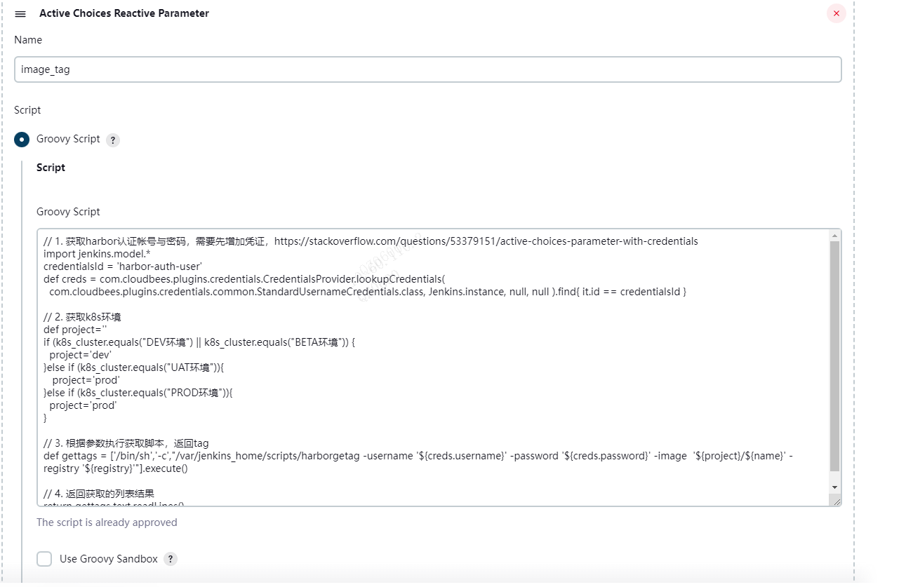
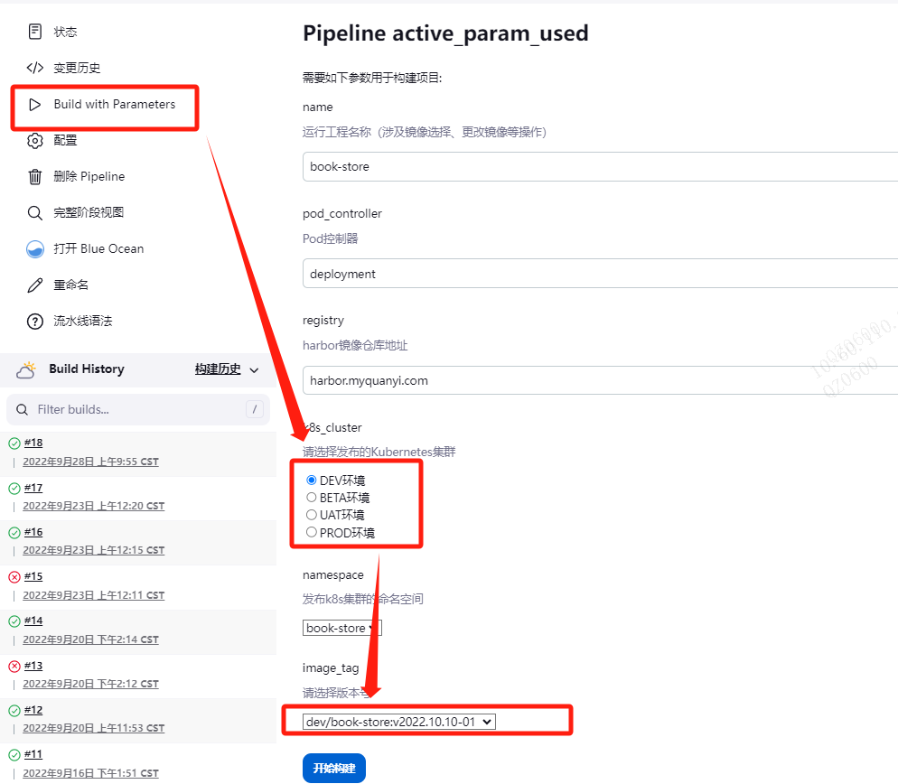

# Harbor Image Tags
> Note:
+ 工具为获取Harbor仓库的某个镜像版本号，结合k8s的kubectl工具发布使用。
+ 代码灵感来源为Jenkins插件项目：[image-tag-parameter-plugin](https://github.com/jenkinsci/image-tag-parameter-plugin)，Jenkins设计k8s的cd可以直接使用此Jenkins插件。
+ 工具可结合Jenkins插件[Active Choices Plug-in](https://plugins.jenkins.io/uno-choice/)使用，但有部分注意点。
## 快速开始
1. 克隆代码&安装
```
$ git clone https://github.com/zeratullich/harborgetag
$ cd harborgetag && CGO_ENABLED=0 GOOS=linux GOARCH=amd64 go build && mv harborgetag /opt
```
2. 使用
```
$ /opt/harborgetag -h
Usage of /opt/harborgetag:
  -filter string
        Regular expression to filter image tag e.g. v(\d+\.)*\d+ for tags like v23.3.2 (default ".*")
  -image string
        Harbor registered mirror image (default "qy/book-store")
  -order string
        Allows the user to alter the ordering of the ImageTags in the build parameter.
    
                Natural-Ordering ... same Ordering as the tags had in prior versions
                Reverse-Natural-Ordering ... the reversed original ordering
                Descending-Versions ... attempts to pars the tags to a version and order them descending
                Ascending-Versions ... attempts to pars the tags to a version and order them ascending
         (default "Descending-Versions")
  -password string
        Harbor auth user password (default "123456")
  -registry string
        Harbor registered mirror address (default "harbor.myquanyi.com")
  -scheme value
        URL request prefix, only one of [http, https] can be selected (default https)
  -username string
        Harbor auth user name (default "admin")
  -verifySSL
        Whether ssl authentication is enabled in harbor (default true)
```
## 与Jenkins插件结合
> 需要首先把编译好的二进制文件放入与Jenkins统一个主机中(vm或者容器)。
1. Jenkins中需要安装[Active Choices Plug-in](https://plugins.jenkins.io/uno-choice/)插件。

1. 结合参数使用。

...
1. 需要在最后再应用`Active Choices Plug-in`插件，并需要使用其`Referenced parameters`引入上述自定义的参数。


1. 点击参数化构建，填入密码，即将可以获取harbor的镜像版本号。

1. 使用Pipeline流水线工作完成CD（持续发布过程）。
示例代码：
```
node('jenkins-application-publish'){
    stage('Publish'){
        container('kubectl'){
            echo "对命名空间：${namespace}的${project_name}项目进行升级或回滚 ！"
            sh "kubectl set image ${pod_controller} ${project_name} ${project_name}=${harbor_domain}/${docker_image} -n ${namespace}"
            echo "回滚完成！" 
            
        }
    }
}
```
其中jenkins-application-publish需要在Jenkins中使用kubernetes插件设置Cloud中定义。


**注意:** Jenkins如果可以安装[image-tag-parameter-plugin](https://github.com/jenkinsci/image-tag-parameter-plugin)插件（需要Jenkins版本比较高），最好使用此插件，因为出现错误时候可以参照Jenkins日志查看错误原因，使用[Active Choices Plug-in](https://plugins.jenkins.io/uno-choice/)插件无法给出错误日志，故排查问题比较困难。且在定义参数时候，密码参数默认值无法传递给此插件，需要在参数化构建时候每次都要重新输入密码（但可以设置密码的默认值，比较不安全，不推荐）比较麻烦，此工程可以用在其他需要获取Harbor仓库镜像版本号的应用上，例如使用脚本获取镜像版本号来作为持续发布（CD）的方案上。
### 手动执行获取tag示例
